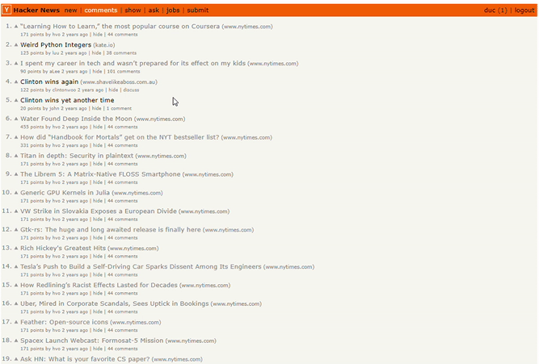
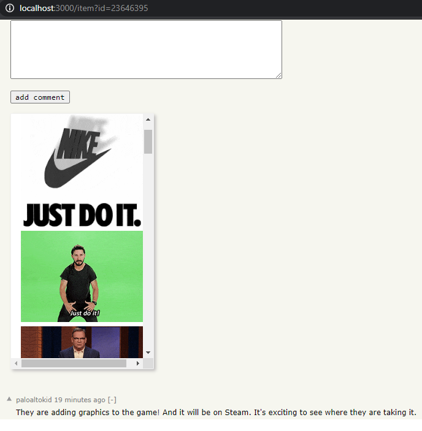

<h2 align="center">Playvation Full Stack Developer Coding Test</h2>

### What I have done

For more comments on the logic/code. Please visit the PR below:
https://github.com/anhduc109/hackernews-react-graphql/pull/1

- Make it possible to comment on posts (stored locally and can be fetched)
  
- A part of comment using GIFs
  

### What can be improved

- Need to have unit test for each of the function that I made
- More code refactoring and optimization
- Finish posting Gif section
- Improving the actual UI design
